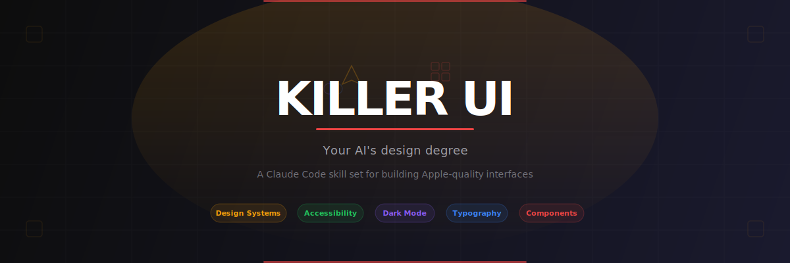
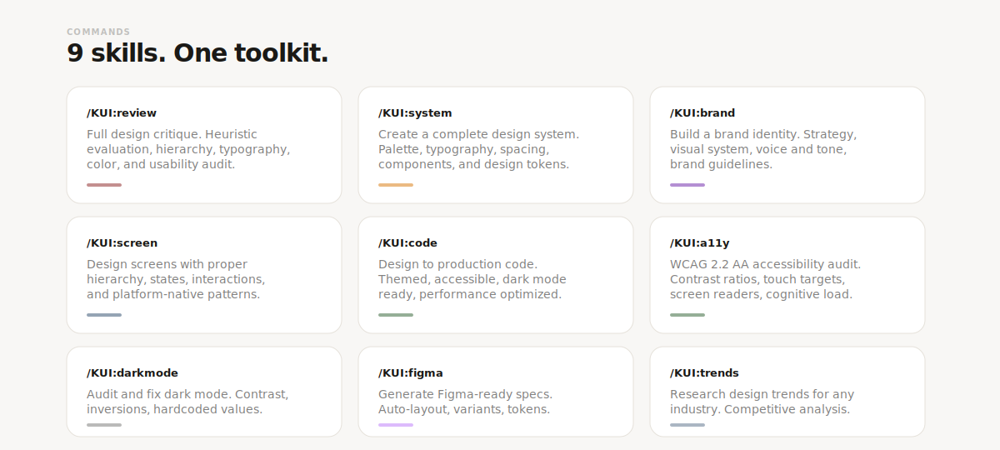
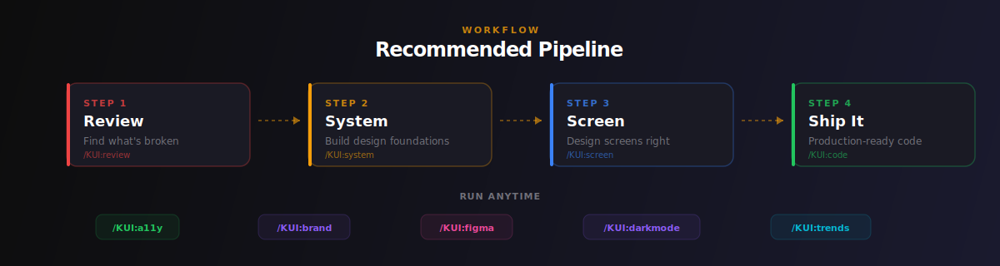

<p align="center">
  
</p>

**Your AI's design degree.** A Claude Code skill set that turns vibe-coded UIs into production-grade, Apple-quality interfaces.

Most vibe-coded apps work fine but look like nobody cared. Random spacing, clashing colors, broken dark mode, no visual hierarchy. Killer UI fixes that by encoding real design expertise into repeatable, auditable workflows.

---

## Commands

<p align="center">
  
</p>

## Quick Start

### Install

```bash
git clone https://github.com/BigSiggis/Killer-UI.git
cd Killer-UI
chmod +x install.sh
./install.sh /path/to/your/project
```

This copies the skill files into your project's `.claude/` directory.

### Use

Open Claude Code in your project and run:

```
/KUI:review
```

That's it. It'll tear your UI apart and tell you exactly what to fix.

---

## Pipeline

<p align="center">
  
</p>

## What's Inside

```
killer-ui/
├── SKILL.md                          # Skill definition
├── install.sh                        # Installer
├── commands/                         # 9 command files
│   ├── system.md                     # Design system generator
│   ├── brand.md                      # Brand identity creator
│   ├── screen.md                     # Screen designer
│   ├── review.md                     # Design critique
│   ├── a11y.md                       # Accessibility auditor
│   ├── code.md                       # Design-to-code translator
│   ├── figma.md                      # Figma spec generator
│   ├── trends.md                     # Trend researcher
│   └── darkmode.md                   # Dark mode auditor
├── agents/                           # Subagent prompt templates
│   ├── design-system-architect.md
│   ├── brand-identity-creator.md
│   ├── ui-pattern-master.md
│   ├── design-critique.md
│   ├── accessibility-auditor.md
│   ├── design-to-code.md
│   ├── figma-expert.md
│   └── trend-synthesizer.md
└── resources/
    ├── INDEX.md
    └── knowledge-base/               # Design knowledge
        ├── design-crimes.md          # 20 common vibe-code design mistakes
        ├── color-theory.md           # Color psychology, palettes, contrast
        ├── typography-rules.md       # Type scale, hierarchy, readability
        ├── dark-mode-patterns.md     # 7 dark mode implementation patterns
        ├── spacing-system.md         # 8px grid, spacing scale, layout rules
        └── component-patterns.md     # Component specs and states
```

## Design Philosophy

1. **Systems over opinions.** Every color, size, and spacing value exists in a scale. No magic numbers.
2. **Dark mode is not an afterthought.** Design for both modes from day one.
3. **Accessibility is not a feature.** It's a baseline. WCAG AA minimum. 44px touch targets. 4.5:1 contrast. No exceptions.

## Requirements

- [Claude Code](https://claude.ai/claude-code) CLI

## License

MIT
